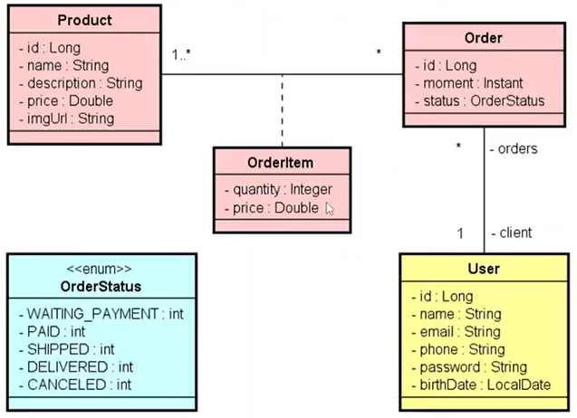
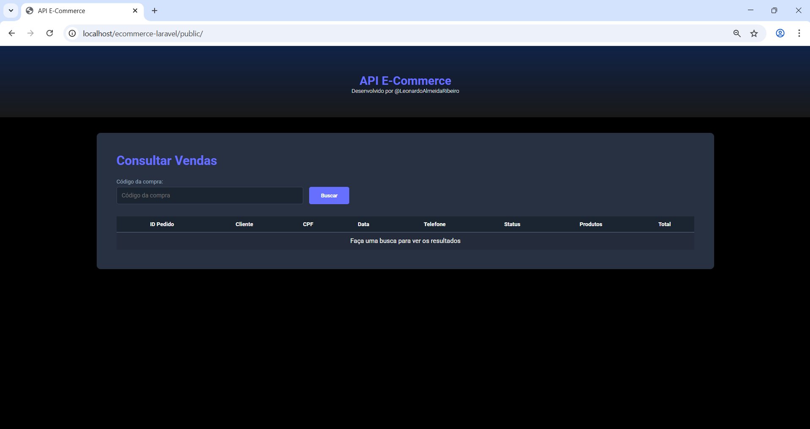
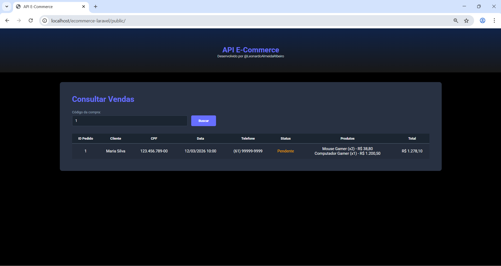
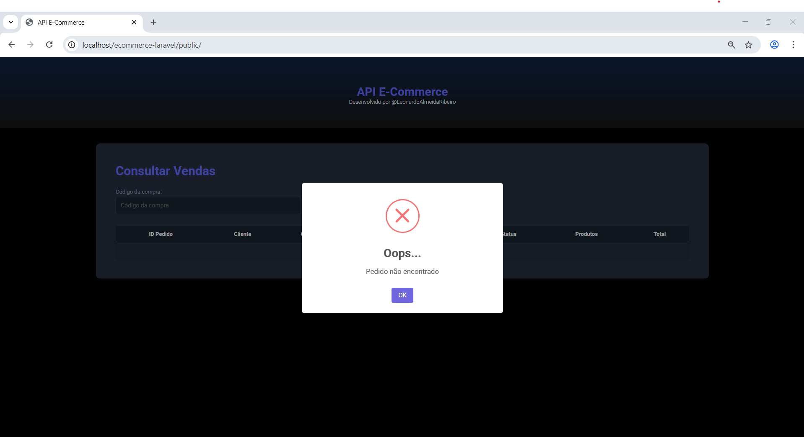
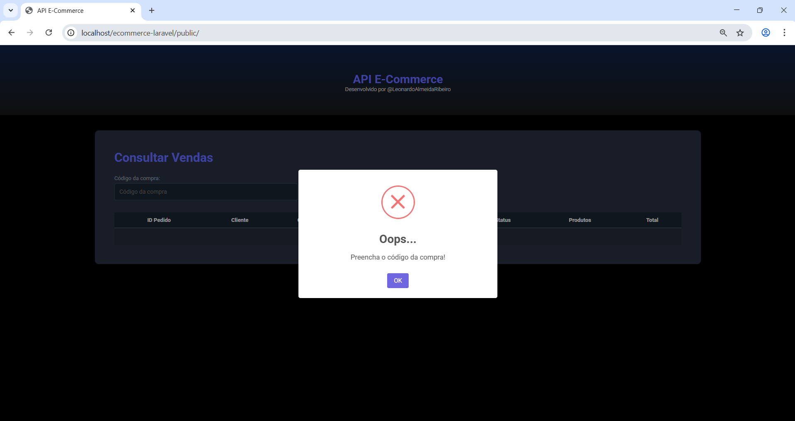

# 🛒 Order Management API (Laravel)

Este projeto é uma API REST desenvolvida em **Laravel** para gerenciamento de pedidos, usuários e produtos, com suporte a relacionamento entre entidades e carregamento otimizado de dados.

---

## 📌 Sobre o projeto

A aplicação simula um sistema de pedidos (orders), onde:

* Um **usuário** pode ter vários pedidos
* Um **pedido** possui vários itens
* Cada **item do pedido** está associado a um produto

A API permite consultar pedidos com todos os seus relacionamentos (usuário e produtos), utilizando **Eager Loading** para melhor performance.

---

## 🚀 Tecnologias Utilizadas

<p align="left">
  
  
  
  
  
  
</p>


---

## 📂 Estrutura do Projeto

O projeto segue a estrutura padrão do Laravel, organizada em camadas como Controllers, Models, Migrations e Seeders.

```
app/
 ├── Http/
 │    └── Controllers/
 │         ├── OrderController.php
 │         └── Api/
 │              └── OrderController.php
 │
 ├── Models/
 │    ├── User.php
 │    ├── Product.php
 │    ├── Order.php
 │    └── OrderItem.php
 │
database/
 ├── migrations/
 │    ├── create_users_table.php
 │    ├── create_products_table.php
 │    ├── create_orders_table.php
 │    └── create_order_itens_table.php
 │
 ├── seeders/
 │    ├── DatabaseSeeder.php
 │    ├── UserSeeder.php
 │    ├── ProductSeeder.php
 │    ├── OrderSeeder.php
 │    └── OrderItemSeeder.php
 │
resources/
 └── views/
      └── index.blade.php
 │
routes/
 ├── web.php
 └── api.php
```

---

## 🧱 Arquitetura

O sistema segue o padrão **MVC (Model-View-Controller)**:

* **Model** → Responsável pelas regras de negócio e acesso ao banco de dados
* **Controller** → Responsável por receber as requisições e retornar as respostas
* **View** → Responsável pela interface do usuário (Blade)
* **API** → Responsável por fornecer os dados em formato JSON

---

## 📌 Responsabilidade de cada parte

| Camada      | Responsabilidade                              |
| ----------- | --------------------------------------------- |
| Models      | Representam as entidades e os relacionamentos |
| Controllers | Controlam as requisições e respostas          |
| Migrations  | Criam a estrutura do banco de dados           |
| Seeders     | Populam o banco com dados de teste            |
| Views       | Interface visual com Blade                    |
| Routes      | Definem as rotas da aplicação                 |

---
## 🗄️ Banco de Dados

O sistema utiliza um banco de dados relacional modelado para um cenário de e-commerce, contendo as entidades **Usuários**, **Produtos**, **Pedidos** e **Itens do Pedido**.

A estrutura foi criada utilizando **Migrations do Laravel**, permitindo versionamento e controle da estrutura do banco de dados. O relacionamento entre as entidades garante a integridade dos dados e segue o padrão:

* Um usuário pode possuir vários pedidos
* Um pedido pertence a um usuário
* Um pedido possui vários itens
* Cada item do pedido está associado a um produto

O Laravel também utiliza tabelas auxiliares para controle de **sessões**, **cache**, **filas** e **tokens de autenticação**, responsáveis por funcionalidades internas do framework.
## Seed do Banco de Dados
_Tabela: Users_
| ID | Nome           | CPF         | Telefone    | Email                                     | Data de Nascimento | Senha |
| -- | -------------- | ----------- | ----------- | ----------------------------------------- | ------------------ | ----- |
| 1  | Maria Silva    | 12345678900 | 61999999999 | [maria@mail.com](mailto:maria@mail.com)   | 2000-11-01         | teste |
| 2  | Alex Ramos     | 12345678901 | 61988888888 | [alex@mail.com](mailto:alex@mail.com)     | 1990-11-01         | teste |

_Tabela: Products_
| ID | Nome             | Descrição                   | Preço   | Image URL    |
| -- | ---------------- | --------------------------- | ------- | ------------ |
| 1  | Mouse Gamer      | Mouse RGB 7200 DPI          | 19.90   | mouse.jpg    |
| 2  | Computador Gamer | Computador Xtreme Turbo RGB | 1200.50 | pc_gamer.png |
| 3  | Teclado Gamer    | Teclado Mecânico            | 39.90   | teclado.png  |
| 4  | Monitor Gamer    | Monitor Tela 21" - 4K       | 560.00  | monitor.png  |
| 5  | Headset Gamer    | Fone Bluetooth              | 250.00  | headset.png  |


_Tabela: Orders_
| ID | Data       | Status          | Cliente (User ID) |
| -- | ---------- | --------------- | ----------------- |
| 1  | 2025-01-10 | WAITING_PAYMENT | 1                 |
| 2  | 2025-01-11 | PAID            | 2                 |
| 3  | 2025-01-12 | SHIPPED         | 3                 |
| 4  | 2025-01-13 | DELIVERED       | 1                 |
| 5  | 2025-01-14 | CANCELED        | 4                 |

_Tabela: Order_Items_
| ID | Data/Hora           | Status          | User ID |
| -- | ------------------- | --------------- | ------- |
| 1  | 2026-03-12 10:00:00 | Pendente        | 1       |
| 2  | 2026-03-12 21:21:21 | Pago            | 2       |
| 3  | 2026-03-12 23:59:59 | Cancelado       | 1       |

_Status do Pedido (ENUM)_
| Status    |
| --------- |
| Pendente  |
| Pago      |
| Enviado   |
| Entregue  |
| Cancelado |


A imagem abaixo apresenta o diagrama do banco de dados com as entidades e seus relacionamentos.
## Diagrama do Banco de Dados

<p align="center">
  
</p>

## 🔄 Fluxo da aplicação

O fluxo básico da aplicação funciona da seguinte forma:

```
Cliente → Rota → Controller → Model → Banco de Dados
                                   ↓
Cliente ← Resposta (View ou JSON) ←
```

Exemplo:

* O usuário acessa `/api/orders/1`
* A rota chama o `OrderController`
* O controller busca os dados no `Model`
* O sistema retorna um JSON com o pedido, usuário e produtos


## 🧠 Conceitos aplicados

* Relacionamentos Eloquent (`hasMany`, `belongsTo`)
* Eager Loading (`with`)
* API REST com retorno em JSON
* Tratamento de exceções
* Migrations e Seeders
* Organização em camadas (Controller → Model)

---

## 🔗 Endpoints

### 📥 Buscar pedido por ID

```
GET /api/orders/{id}
```

### ✅ Resposta de sucesso
```json
{
  "success": true,
  "data": [
    {
      "id": 1,
      "moment": "2026-03-12 10:00:00",
      "status": "Pendente",
      "user": {
        "id": 1,
        "name": "Maria Silva",
        "cpf": "12345678900",
        "phone": "61999999999",
        "email": "maria@mail.com"
      },
      "order_itens": [
        {
          "quantity": 1,
          "price": 19.90,
          "product": {
            "id": 1,
            "name": "Mouse Gamer"
          }
        }
      ]
    }
  ],
  "message": "Pedido encontrado!"
}
```
### ❌ Pedido não encontrado (404)

```json
{
  "success": false,
  "data": [],
  "message": "Pedido não encontrado"
}
```
### ⚠️ Erro interno (500)
```json
{
  "success": false,
  "error": "Erro ao recuperar pedido",
  "message": "Erro interno do servidor"
}
```
---

## 🖥️ Visualização (Web)


### Tela Inicial


### Pedido Encontrado


### Pedido Não Encontrado


### Validação de Campo


### Busca na API

---


## ⚙️ Como rodar o projeto

```bash
# Clonar o repositório
git clone git@github.com:LeonardoAlmeidaRibeiro/ecommerce-site.git

# Entrar na pasta
cd seu-repo

# Instalar dependências
composer install

# Copiar .env
cp .env.example .env

# Gerar chave
php artisan key:generate

# Configurar banco no .env

# Rodar migrations + seeders
php artisan migrate --seed

# Subir servidor
php artisan serve
```

---

## 👨‍💻 Autor

Desenvolvido por **Leonardo Almeida Ribeiro**

---

## 📄 Licença

Este projeto está sob a licença MIT.
